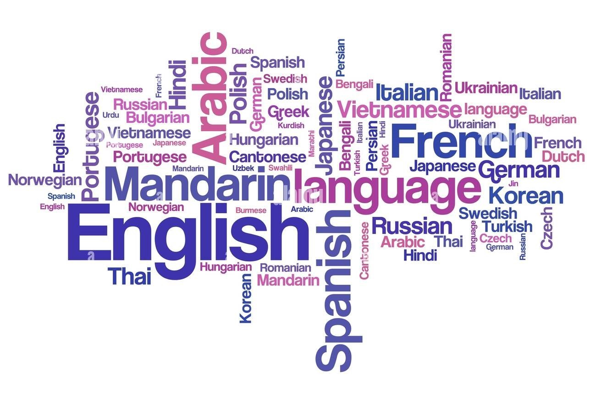
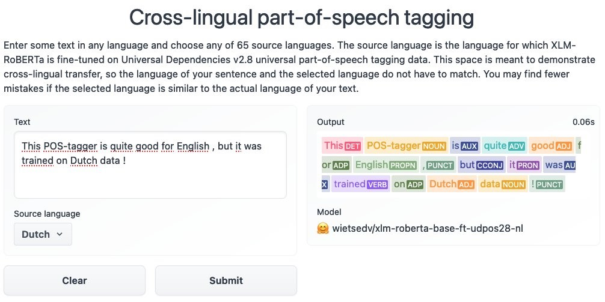
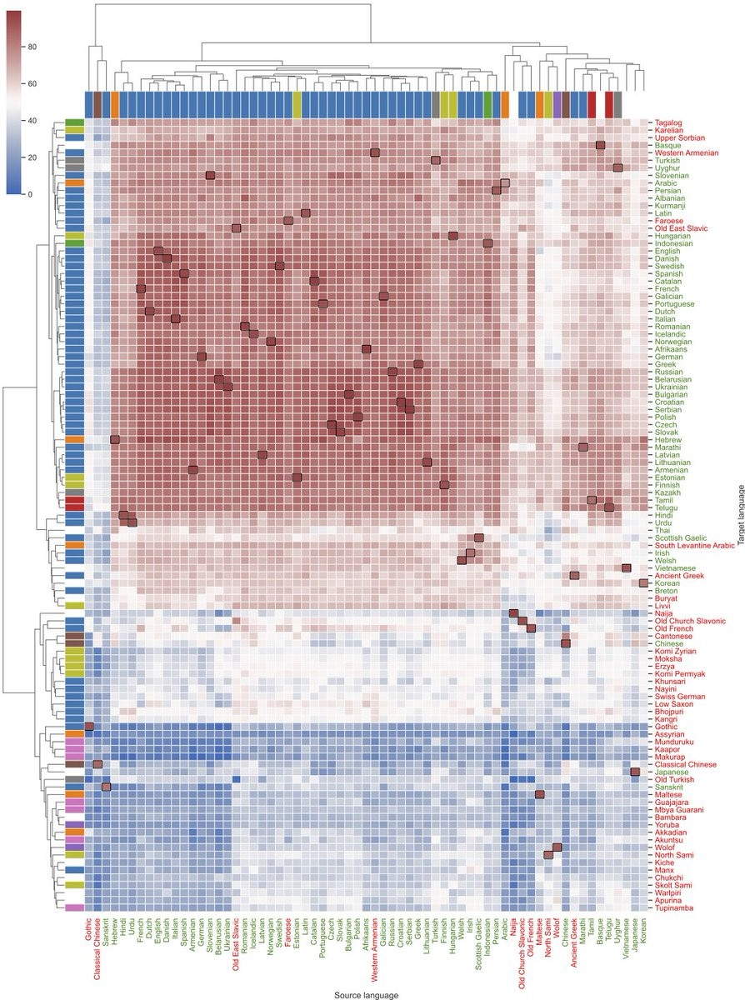
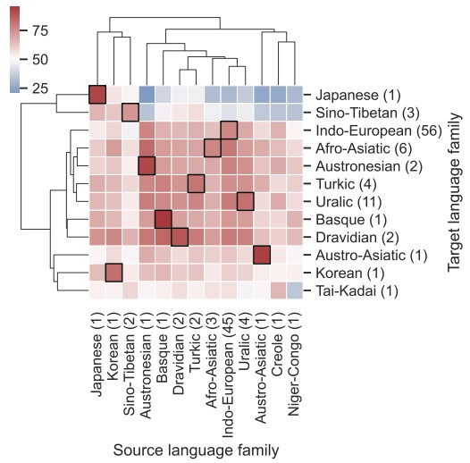
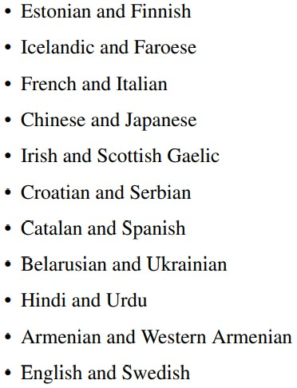

Hello amazing readers! In this post, I would like to discuss the paper *Make the Best of Cross-lingual Transfer: Evidence from POS Tagging with over 100 Languages* which is authored by Wietse de Vries, Martijn Wieling, and Malvina Nissim. 

Reading Time: About 10 minutes.

Paper：<https://aclanthology.org/2022.acl-long.529>

Code: <https://github.com/wietsedv/xpos>

Demo: <https://huggingface.co/spaces/wietsedv/xpos>

<!-- more -->
## Introduction

A lot of models today rely on fine-tuning pre-trained models for most of the NLP tasks with annotated data very specific to the task. But so many languages don't have such labelled data available. Think about Afrikans,Estonian, Sanskrit, Welsh to name a few! Can we take help from other languages? One idea is to use cross-lingual fine tuning of multilingual pre-trained language models such that we can then use data from one language (say source language, one that has labelled data) to model phenomenon from another language (say target language, one that does not have labelled data). Can you think of the most commonly used language for such models? You guessed that right! Most of the times, the language that is used to do so is English! But is that really accurate? Aren't we making an assumption here that English is a representative source language? Perhaps, similarities between source and target languages can influence our results. So how do we determine what a good source and target language is for cross lingual transfer? 

## Case Study 

So...How can we perform things like say, parts-of-speech (POS) tagging for low-resource languages that have limited to no training data?

In this article, we will address this problem and talk about a case study of cross-lingual transfer learning with POS tagging (POS tagging is chosen as a case study due to data availability). A part of speech is essentially a group of words which share similar grammatical properties, for example, nouns, pronouns, verbs, etc. are parts of speech in English! POS tagging refers to tagging a word with its part of speech. Whenever we will refer to POS tagging, that's what we mean. So...How can we perform things like parts of speech tagging for low-resource languages that have limited to no training data? 

## Contributions

Overall, the paper's contributions are as follows:

1. They explore the limits and factors to what makes a successful cross-lingual transfer, especially focusing on POS tagging. 

2. They bring insights on how similar language families and similar writing systems in addition to pretraining affect cross-lingual training.

3. Finally, they help understand and evaluate the performance when transfering to a low-resource language with limited to no annotated data.

Here is an example demo from the huggingface that better illustrates the work:

## Approach and Results

They fine-tune a pre-trained model for POS tagging using different languages for training and testing. A source and a target language would essentially give an accuracy score, which can then be visualized as a large matrix of accuracies. Cross-lingual is when source and target languages are not the same and monolingual is when they are - these accuracies provide us with the a) insights of how appropriate a source language is for cross-lingual POS tagging and b) the challenges for POS tagging a target language without having the monolingual training data. They use the POS tag data from Universal Dependencies 2.8 [2] that contains manually annotated data for 114 languages. They set up transfer learning with 65 different source languages and 105 target languages for POS tagging. The XLM-RoBERTa base model [3] is used for expeiments. Please refer to the paper or contact me if you want to learn more about the method and experiments!

Note that all models are trained with the same hyper-parameter settings.

This figure illustrates the POS tagging (test) accuracies for every combination of source and target language. The source langauges are represented by columns and target languages are represented by rows. XLM-RoBERTa base is fine-tuned on the source langauge. The colors that we see here in the dendograms represent different language families. This heat map essentially shows that the model has a relatively high performance where source and target languages match. Also, for quite a few target languages, we can observe high performance when trraining is done on several other languages. The authors highlight Russian in this case as an example. The authors also highlight a substantial amount of variation for cross-lingual accuracies, and show that whether source and target languages are part of the same language family really matters for accuracy. 

We can see that high performance can be observed within language families (highlighted using black outlines in the figure) - if we think about it, this is quite intuitive! The authors also find that accuracy is higher when the source and target language are the same, but transfer also works between different families. The figure might also help us understand that some family combinations might not be suitable. 

We can see that some writing systems have very low accuracies and others that are used by a single target language have high performance irrespective of the source languages. The authors highlight Tamil, Hebrew, Telugu as some examples. Cross-script transfer seems to work very well for some writing systems.

The authors identify the lowest within-language accuracy to be in case of Sanskrit (84.2%). The low performing source languages are then identified based on this threshold, i.e., where the best cross-lingual accuracy is below 84.2%. 

The authors also highlight some interesting optimal language pairs. In some of these pairs, such as French and Italian or Hindi and Urdu, I can personally relate to their similarities! The authors claim that highly similar languages are the best source languages for each other.

## Discussion and Conclusion

We see that the findings suggest what a good source language should have - 

1. A source language should have sufficient training data available. 

2. It should be included in pre-training data with the same writing system as the task-specific training data, or we should include a mutually intelligible related language. 

3. It should have good within-language performance. What about cross-lingual performance? Some source langauages are very low-resource and the model can perform poorly on the source language itself so we cannot guarantee a high cross-lingual performance. 

4. The source language should have the same writing system type as the target langauge as we saw in the above sections. 

Overall, the paper shows that simply fine-tuning a large multilingual pre-trained language model on English data may not be the best idea unlike what we see in a lot of cases! For instance, when we want cross-lingual training for a low-resource language, there might be several other factors impacting the performance. The experiments show that the target language or a highly similar language should be included in pre-training for a successful crosslingual training. But sadly, we also see that for many such languages, the data is simply very poor and scarcely available. It becomes very important to collect relevant data for these languages.

The paper highlights these findings for the case study of POS tagging (mainly due to data availability for POS tagging) but it opens ways and shows potential for these findings to be relevant for other tasks as well! 

Check out the cool demo on huggingface!

## Done! Thank you! 
Thank you for being so patient and reading the blog! I tried to keep things very simple - hope you understood and enjoyed reading! Feel free to reach out or consult the paper for more details! Stay tuned readers! 

## References

[1] [Make the Best of Cross-lingual Transfer: Evidence from POS Tagging with over 100 Languages](https://aclanthology.org/2022.acl-long.529) (de Vries et al., ACL 2022)

[2] [Universal Dependencies](https://aclanthology.org/2021.cl-2.11) (de Marneffe et al., CL 2021)

[3] [Unsupervised Cross-lingual Representation Learning at Scale](https://aclanthology.org/2020.acl-main.747) (Conneau et al., ACL 2020)

